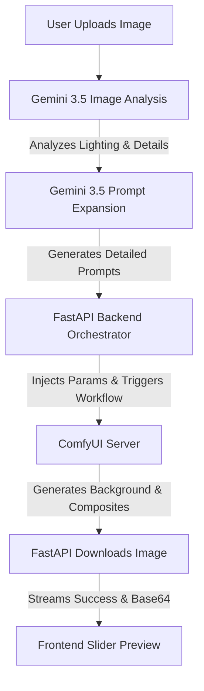

# AI Background Replacer

A premium, orchestrated web application for automated, pixel-perfect AI background replacement. Upload a photo, describe your desired background, and get a realistic composited result with lighting-matched inpainting.

The system orchestrates a multi-stage pipeline combining **Gemini 3.5** (for image analysis and prompt expansion) and **ComfyUI** (for matting and diffusion-based inpainting).

---

## 🚀 Key Features

### 1. Bring Your Own Key (BYOK) Design
- User-provided credentials (Gemini API key and ComfyUI address) are stored **only client-side** (cached in `localStorage`) and sent per-request.
- No keys or inputs are ever persisted server-side.

### 2. Multi-Stage Pipeline Orchestration
- **Intelligent Image Analysis (Gemini 3.5)**: Analyzes the uploaded photo's lighting (direction/quality), edge complexity, and background/studio contamination. Detects reflective surfaces (like glasses) to flag potential matting errors. Automatically calculates optimal subject mask grow (`recommended_bg_mask_grow_px`) and feather (`recommended_feather_px`) values.
- **Context-Aware Prompt Expansion (Gemini 3.5)**: Converts a simple description (e.g., *"sunny beach"*) into a detailed positive/negative prompt pair, blending the requested environment with the original subject's lighting features.
- **Background Matting & Inpainting (ComfyUI)**: Leverages a configured ComfyUI pipeline (`BRIAAI Matting` for clean cutouts, combined with a `VAE Encode/Decode` and `KSampler` using an inpainting checkpoint) to composite and blend the subject.
- **Real-Time Progress Streaming**: Uses Server-Sent Events (SSE) to stream status descriptions, elapsed time, and progress percentages to the client.

### 3. Interactive Web Interface
- **Premium Design**: Dark-themed, responsive glassmorphism UI with smooth animations.
- **Drag-and-Drop Upload**: Supports raw file drops, copy-paste, and file browsing with local image scaling to prevent VRAM out-of-memory errors.
- **Before / After Comparison Slider**: An interactive, draggable comparison slider to inspect the final composited image against the original.
- **Details Logs Panel**: Expandable log viewer showing exact prompt expansions, calculated lighting attributes, and mask adjustments.

---

## 🛠️ Repository Layout

```
├── backend/
│   ├── app/
│   │   ├── analyze_image.py    # Gemini image analysis and retry logic
│   │   ├── comfyui_client.py   # WebSocket/HTTP client for ComfyUI integration
│   │   ├── config.py           # BYOK request config resolver
│   │   ├── expand_prompt.py    # Gemini prompt expansion logic
│   │   └── main.py             # FastAPI orchestrator and SSE stream setup
│   └── requirements.txt        # Python backend dependencies
│
├── frontend/
│   ├── src/
│   │   ├── App.jsx             # Main React UI with interactive comparison slider
│   │   ├── index.css           # Custom glassmorphism styling
│   │   └── main.jsx
│   ├── package.json
│   └── vite.config.js
│
├── workflows/
│   └── background_replacer.json # API-format ComfyUI workflow template
│
└── Dockerfile                  # Unified builder for frontend and backend
```

---

## 🔧 Prerequisites

1. **Gemini API Key**: Obtain a key from the [Google AI Studio](https://aistudio.google.com/).
2. **ComfyUI Server**: A running ComfyUI instance with:
   - [BRIAAI Matting](https://github.com/huchenlei/ComfyUI-BRIAAI-Matting) node (or compatible background removal node).
   - An inpainting checkpoint model (e.g., `epicrealism_pureEvolutionV5-inpainting.safetensors`).
   - Standard ComfyUI custom nodes: `GrowMask`, `FeatherMask`, `InvertMask`.

---

## 📦 Getting Started

### Option 1: Running with Docker (Recommended)

Build and run both the frontend and backend in a single container:

```bash
# Build the Docker image
docker build -t bg-replacer .

# Run the container
docker run -p 8000:8000 bg-replacer
```

Access the app at `http://localhost:8000`.

---

### Option 2: Local Development Setup

#### Backend Setup

1. Navigate to the `backend/` directory:
   ```bash
   cd backend
   ```
2. Create and activate a virtual environment:
   ```bash
   python -m venv venv
   # On Windows:
   venv\Scripts\activate
   # On macOS/Linux:
   source venv/bin/activate
   ```
3. Install dependencies:
   ```bash
   pip install -r requirements.txt
   ```
4. Run the development server:
   ```bash
   uvicorn app.main:app --reload --host 127.0.0.1 --port 8000
   ```

#### Frontend Setup

1. Navigate to the `frontend/` directory:
   ```bash
   cd frontend
   ```
2. Install dependencies:
   ```bash
   npm install
   ```
3. Start the development server:
   ```bash
   npm run dev
   ```
4. Open the development URL (usually `http://localhost:5173`) in your browser.

---

## 💡 How It Works


